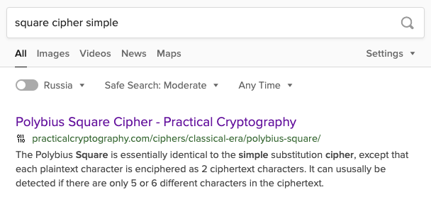

# Арбатско-покровская линия?: Write-up

У этого таска есть два пути решения. 

## Путь первый. Простой 

Можно было угадать криптографический алгоритм по ряду намёков:

- поскольку в условии задачи дан и шифртекст, и алгоритм, которым он получен, явно применялся симметричный шифр;
- в коде часто фигурирует число 6;
- в шифртексте много чисел, но состоят они только из чисел от 1 до 6;
- в алфавите отсутствует буква `z`, зато его длина — ровно 36 (6²) символов.

Ключевые слова: _квадрат, простой, шифр_:



И действительно. Это так называемый квадрат Полибия: алфавит последовательно выписывается в квадрат, а каждый символ открытого текста записывается как два числа: номер столбца и номер строки соответствующего символа в этом квадрате. В интернете есть онлайн-дешифраторы, но давайте напишем свой на Питоне. Алгоритм несложный:

```python
alphabet = "abcdefghijklmnopqrstuvwxy_1234567890"
ciphertext = "43 21 [...] 15".split()


def decode_one(character):
   row, col = map(int, character)
   index = (row -1) * 6 + (col - 1) # вычитаем по единице — индексация с нуля
   return alphabet[index]


print(''.join(decode_one(x) for x in ciphertext))
```

## Путь второй. Интересный

Можно было ничего не угадывать, а понять, что это за среда. Тогда становится понятной цепочка преобразований открытого текста — и, следовательно сам алгоритм. Среда называется APL и представляет собой язык программирования из шестидесятых, ориентированный на работу с числами и массивами. Это определяется, во-первых, по странным значкам в коде, во-вторых, по названию таска (и, в особенности, по его URL). 

> Любопытно, что этот язык появился до массового распространения компьютерных мониторов — для работы с ним [люди использовали печатающие терминалы](https://www.youtube.com/watch?v=_DTpQ4Kk2wA), причём той модели, которая способна воспроизводить большой набор нестандартных символов, и которая уже знакома преданным фанатам наших соревнований, — [IBM Selectric](https://github.com/teamteamdev/ugractf-2020-quals/tree/master/tasks/selectric).
>
> Кстати, специальные символы языка чуть ли не целиком занимают [отдельный специализированный блок Юникода](https://www.unicode.org/charts/PDF/U2300.pdf).

Язык обладает нехитрым синтаксисом, который лишь кажется сложным из-за закорючек, стрелочек и прочих греческих букв. Каждое выражение выполняется справа налево (скобки в приоритете). Записанные подряд числа формируют массивы: `1 2 3`. Между числом или массивом можно поставить значок — функцию. У неё может быть либо один аргумент: `(⍳10)`, либо два: `1 + 3`. Вот перечень некоторых функций, используемых в таске:

| Символ | Один аргумент                                                                                                          | Два аргумента                                                                                                                                              |
|--------|------------------------------------------------------------------------------------------------------------------------|------------------------------------------------------------------------------------------------------------------------------------------------------------|
| `⍳`    | Последовательность от 0 до аргумента как `range()`                                                                     | Индекс элемента (правый аргумент) в массиве (левый аргумент)                                                                                               |
| `~`    | Логическое отрицание                                                                                                   | Массив (левый) без элемента (правый)                                                                                                                       |
| `⍴`    | Длина правого аргумента как `len()`                                                                                    | Изменяет размерность правого аргумента согласно левому аргументу как [`np.reshape()`](https://numpy.org/doc/stable/reference/generated/numpy.broadcast_to.html) |
| `⍉`    | Транспонированный аргумент как [`np.ndarray.T`](https://numpy.org/doc/stable/reference/generated/numpy.ndarray.T.html) | —                                                                                                                                                          |
| `×`    | Знак (плюс или минус) правого аргумента                                                                                | Умножение                                                                                                                                                  |
| `⌈`    | Округление вверх                                                                                                       | Выбирает наибольший аргумент                                                                                                                               |
| `¨`    | —                                                                                                                      | Применить левый аргумент к каждому элементу правого как `map()`                                                                                            |
| `/`    | —                                                                                                                      | Как [`functools.reduce()`](https://docs.python.org/3/library/functools.html#functools.reduce)                                                              |

Можно совершать преобразования на листочке или в уме, а можно найти [какой-нибудь интерпретатор APL](https://tryapl.org/). Давайте смотреть. Сперва язык получает два не осбо интересных указания:

1. индексировать массивы не с единицы, а с ноля: `⎕IO ← 0`;
2. запомнить алфавит как переменную `A`.

Затем начинается интересно. Складывается матрица 6×6 (`6 6 ⍴ 1`) чисел от 1 до 6 (`1 + ⍳6`) и такая же матрица, домноженная на 10 и повёрнутая набок. Получается матрица индексов `I` для квадрата Полибия:
```
11 12 13 14 15 16
21 22 23 24 25 26
31 32 33 34 35 36
41 42 43 44 45 46
51 52 53 54 55 56
61 62 63 64 65 66
```

Затем строится сам квадрат Полибия `S` из символов алфавита `A`:
```apl
      S ← 6 6 ⍴ A
```

Теперь определяется функция `E`, которая имеет один аргумент `⍵`. Она делает вот что (на примере буквы `u`).

1. Находит, в какой позиции находится `⍵` в квадрате `S`: (~⍵ ⍳ S):
```
0 0 0 0 0 0
0 0 0 0 0 0
0 0 0 0 0 0
0 0 1 0 0 0
0 0 0 0 0 0
0 0 0 0 0 0
```

2. Находит произведение матрицы выше с квадратом индексов `I`, выступая в роли маски. Получается квадрат индексов, в котором все нули, кроме индекса, соответствующего `⍵`:
```
0 0  0 0 0 0
0 0  0 0 0 0
0 0  0 0 0 0
0 0 43 0 0 0
0 0  0 0 0 0
0 0  0 0 0 0
```

3. Дважды находит максимальный элемент в таком квадрате — сперва по строкам, затем по столбцам: `⌈/ ⌈/ [...]`.

Эта функция применяется к каждому символу флага: `E¨flag`. Совсем не трудно придумать обратное преобразование, и мы это успели сделать, когда пошли первым путём.

На Питоне этот код мог выглядеть бы вот так, если перевести его «дословно»:
```python
import numpy as np
flag = "ugra_the_next_station_is_esoteric_programming_..."

A = "abcdefghijklmnopqrstuvwxy_1234567890"
I = np.broadcast_to(1 + np.arange(6), (6, 6)) + np.broadcast_to(10 * (1 + np.arange(6)), (6, 6)).T
S = np.reshape(list(A), (6,6))
E = lambda x: np.maximum.reduce(np.maximum.reduce((x == S) * I))

print(list(map(E, flag)))

```


Флаг: **ugra_the_next_station_is_esoteric_programming_cf902c2f1b142ce853f9b5bd66dd507d2351e7f56e3f86195e7b919b3e**
