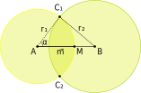

# Морской бой: Write-up

Задача на программирование и простую геометрию.

Нам предлагают поиграть в «Морской бой». На деле правила сильно отличаются — корабль у врага всего один, и ответным огнём он не отвечает. Зато активно передвигается — немного поиграв, это сразу можно заметить. При этом время и количество выстрелов ограничено. Сервер выдаёт несколько вариантов ответа, раличаемых по полю `"status"` в возвращаемом JSON:

+ `"game_not_started"`: необходимо начать игру;
+ `"game_over"`: игра окончена (закончилось время);
+ `"rockets_ran_out"`: игра окончена (не осталось снарядов);
+ `"miss"`: непопадание;
+ `"hit"`: корабль уничтожен.

В случае непопадания сервер возвращает ещё и расстояние до корабля. Таким образом и можно вычислить его положение. Однако сделать это вручную не удастся из-за движения судна, и придётся писать программу для решения. Местонахождение корабля мы будем вычислять с помощью _триангуляции_.

## Триангуляция

Истоки метода восходят к древнему Египту, и в разных модификациях он применяется для множества задач. Суть метода в нахождении местоположения объекта путём измерений расстояния до него с нескольких отдалённых точек.

Предположим, что точное положение нашей цели неизвестно, но мы можем получить расстояние до неё из произвольной точки. Измерим первое расстояние до цели — r<sub>1</sub> (от точки A). Нарисуем окружность с центром в A и радиусом r<sub>1</sub>. Искомый корабль будет находиться на этой окружности.

Теперь выберем точку B произвольно так, чтобы она находилась за пределами окружности, и получим расстояние до цели r<sub>2</sub>. Нарисуем вторую окружность. Здесь возможны три варианта:

1. Окружности пересеклись в одной точке и находятся рядом: такое может быть, если мы случайно выбрали точку B так, что цель находится точно между A и B. Радиусы окружностей будут равны;
2. Окружности пересеклись в двух точках (как на рисунке): цель находится в одной из этих точек;
3. Окружности пересеклись в одной точке и вторая окружность включает в себя первую. Это происходит, если точка A находится ровно между целью и точкой B. В таком случае r<sub>2</sub> = 2 r<sub>1</sub>, и центр окружности B оказывается на окружности с центром в A.



В первом и третьем случаях решение уже найдено. Если окружности находятся рядом, нужно найти среднюю точку между A и B: T̅ = (A̅ + B̅) / 2. Если же окружности вложены друг в друга, можно найти точку T̅ = A̅ - (B̅ - A̅), которая и будет искомой.

Наконец, в случае (2) нам неясно, в какой из двух точек (C<sub>1</sub> или C<sub>2</sub>) находится цель. Для того, чтобы найти эти точки, нужно воспользоваться тем, что все стороны треугольника ABC<sub>1</sub> нам известны. Воспользуемся теоремой косинусов:

AB = sqrt((x<sub>B</sub> - x<sub>A</sub>)<sup>2</sup> + (y<sub>B</sub> - x<sub>A</sub>)<sup>2</sup>);

r<sub>2</sub><sup>2</sup> = AB<sup>2</sup> + r<sub>1</sub><sup>2</sup> - 2 r<sub>1</sub> AB cos α;

cos α = (AB<sup>2</sup> + r<sub>1</sub><sup>2</sup> - r<sub>2</sub><sup>2</sup>) / 2 r<sub>1</sub> AB;

sin α = sqrt(1 - cos<sup>2</sup> α).

Теперь найдём вектор AM (m̅): m̅ = (B̅ - A̅) ⋅ r<sub>1</sub> / AB.

И повернём его на углы α и -α:

c̅<sub>1</sub> = (cos α ⋅ x<sub>m</sub> - sin α ⋅ y<sub>m</sub>, sin α ⋅ x<sub>m</sub> + cos α ⋅ y<sub>m</sub>);

c̅<sub>2</sub> = (cos -α ⋅ x<sub>m</sub> - sin -α ⋅ y<sub>m</sub>, sin -α ⋅ x<sub>m</sub> + cos -α ⋅ y<sub>m</sub>) = (cos α ⋅ x<sub>m</sub> + sin α ⋅ y<sub>m</sub>, -sin α ⋅ x<sub>m</sub> + cos α ⋅ y<sub>m</sub>);

Соответственно, точка C̅<sub>1</sub> = A̅ + c̅<sub>1</sub>; C̅<sub>2</sub> = A̅ + c̅<sub>2</sub>.

Выстрелим по C<sub>1</sub>. Если мы попали, победа в наших руках. Если же нет, выстрелим сразу же по C<sub>2</sub>.

Готовый код на Python, использующий библиотеки NumPy и requests:

```python
import requests
import numpy as np
import sys
import math

BATTLESHIP_URL = "https://battleship.q.2021.ugractf.ru/token"

with requests.Session() as s:
  # Start the game.
  s.post(f"{BATTLESHIP_URL}/reset", cookies=jar).raise_for_status()

  def fire(p):
    """
    Fire at given NumPy point. Return distance on a miss, otherwise print result and exit.
    """

    ret = s.post(f"{BATTLESHIP_URL}/fire", cookies=jar, data={"x": p[0], "y": p[1]})
    ret.raise_for_status()
    robj = ret.json()
    if robj["status"] == "miss":
      return robj["distance"]
    else:
      print(robj)
      sys.exit(0)
  
  A = np.array([0, 0])
  r1 = fire(A)
  B = np.array([2 * r1, 0])
  r2 = fire(B)

  if np.isclose(r1, r2):
    dist = fire((A + B) / 2)
    raise RuntimeError(f"Unexpected miss in case (1) with distance {dist}")
  elif np.isclose(r2, 2 * r1):
    dist = fire(A - (B - A))
    raise RuntimeError(f"Unexpected miss in case (3) with distance {dist}")
  else:
    AB = np.linalg.norm(B - A)
    cos_a = (AB * AB + r1 * r1 - r2 * r2) / (2  * r1 * AB)
    sin_a = math.sqrt(1 - cos_a * cos_a)
    m = (B - A) * (r1 / AB)
    c1 = np.array([cos_a * m[0] - sin_a * m[1], sin_a * m[0] + cos_a * m[1]])
    c2 = np.array([cos_a * m[0] + sin_a * m[1], -sin_a * m[0] + cos_a * m[1]])
    fire(A + c1)
    fire(A + c2)
    raise RuntimeError("Miss")
```

Флаг: **ugra_gotta_hit_fast_3e8ef2d0fd48**
