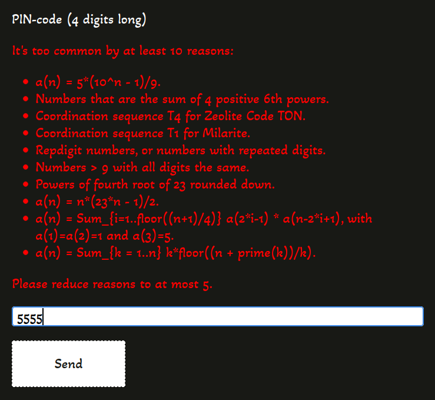
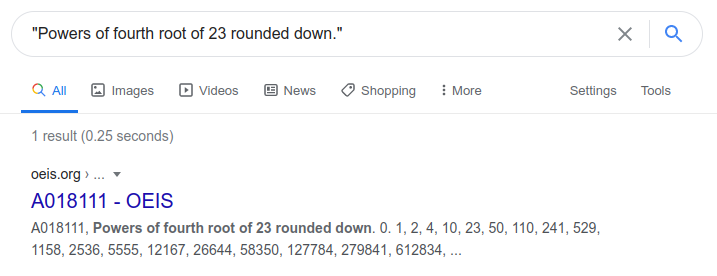

# Конгресс: Write-up

Переходя по ссылке, мы попадали на сайт Международного математического конгресса — 2022. Выглядел он не очень-то и современно, но это не так важно. Понимаем, что наша цель — во что бы то ни стало попасть на этот Конгресс, и идём регистрироваться.

Заполняем фамилию, имя, логин, а с пин-кодом проблемы: нам сообщают, что он слишком популярен.

Первое желание, возникающее при виде такого задания — просто перебрать все четырёхзначные числа. Однако, уже после пятого запроса сайт отправляет нас подождать некоторое время. Таймаут в несколько минут заставляет нас отказаться от этой идеи.

Что ж, пойдём искать эти самые последовательности. Для большей их части мы наткнёмся на сайт [OEIS](https://oeis.org), который гордо именует себя «Онлайн-энциклопедией числовых последовательностей»¹.

Обнаруживаем, что нередко ответы из OEIS по тому или иному числу полностью дублируют выдачу нашего сайта. Очевидно, что организаторы Конгресса вряд ли стали бы придумывать сотни и тысячи числовых последовательностей лишь с целью усложнить математикам жизнь: у нас возникают подозрения, что сайт конгресса как раз и ищет пин-коды в OEIS.

В документации [узнаём](https://oeis.org/hints.html), что искать последовательности, содержащие нужное число, нужно с помощью специального оператора: `seq:1234`.

Далее есть несколько путей.

## Перебор

Мы можем просто для каждого числа от 1000 до 9999 сделать запрос в OEIS и распарсить ответ, чтобы узнать количество совпадений. Можно даже не парсить: OEIS поддерживает `&fmt=text` для получения текстового ответа и `&fmt=json` для получения ответа в формате JSON.

Однако, если перестараться — то OEIS нас заблокирует за слишком быстрый скрейпинг. Так произошло, в том числе, с эксплойтом от автора.

## База данных

На самом деле, у OEIS есть встроенная Вики, на которой расположена различная документация. В частности, там есть [ссылки на дампы](https://oeis.org/wiki/JSON_Format,_Compressed_Files) всей базы, обновляемые ежедневно. Нам нужен первый — sequences and their A-numbers. Ищем в последовательностях каждое число и находим единственное, которое есть всего в пяти последовательностях. Это — [9935](http://oeis.org/search?q=seq:9935).

Мы не писали отдельный скрипт для решения, но вы можете [посмотреть](parse_oeis.py), как наполнялась база, из которой и выдавал последовательности наш сервер.

## Бонус: OSINT

> Спасибо [Матвею Сердюкову](https://github.com/baksist) за этот способ. Он не был предусмотрен изначально.

Помимо всего этого, на той же Вики нашлась [статья про частоту встречаемости чисел](https://oeis.org/wiki/Frequency_of_appearance_in_the_OEIS_database) в базе OEIS. Она уже потеряла свою актуальность — исследование было проведено 13 лет назад, в 2008 году, а база пополняется новыми последовательностями чуть ли не каждую неделю.

Тем не менее, за это время «интересность» чисел не сильно изменилась, и одно из них — 9935 — всё ещё остаётся самым редко встречаемым среди первых десяти тысяч чисел.

> Среди пятизначных чисел уже довольно много таких (чуть более 10 000), что они встречаются в OEIS всего один раз.

Флаг: **ugra_what_a_beautiful_number_85829a3e3026**

¹ В оригинале «integer sequences» — «последовательностей из натуральных чисел»
