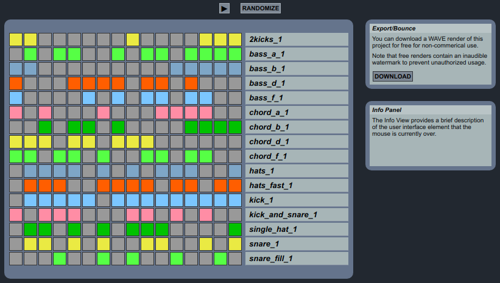
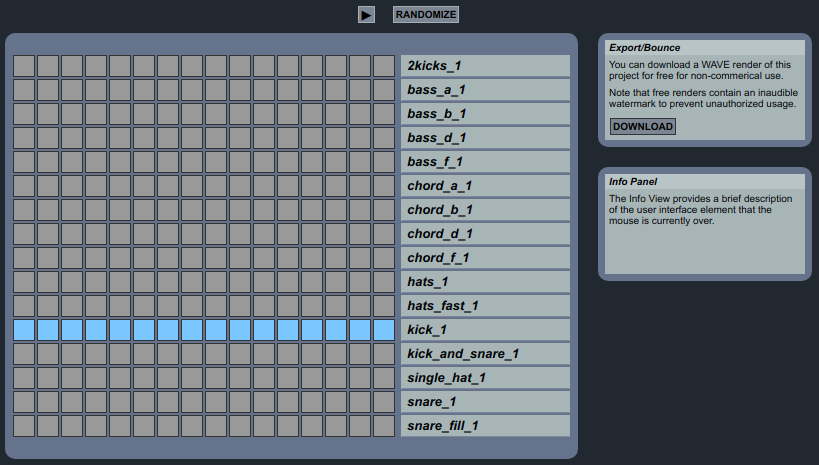
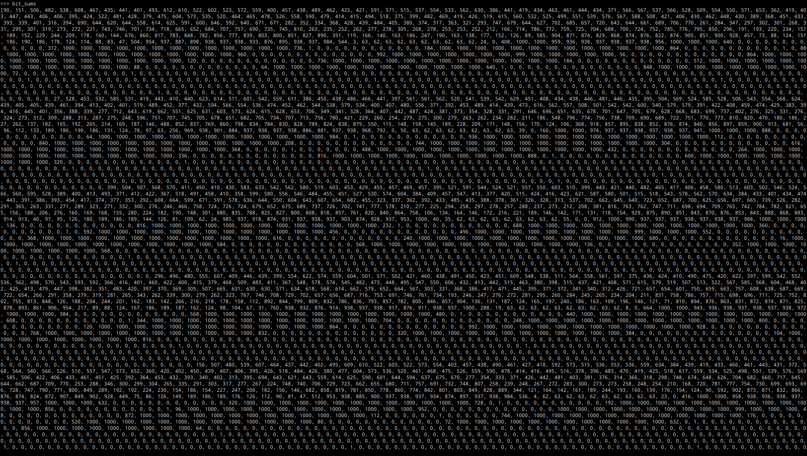

# Hantaton Live: Write-up

Нам предлагается _программный секвенсер_, работающий прямо в браузере. Можно сочинить свою мелодию, используя инструменты, которыми сыграна [завершающая мелодия из титров последнего видеоразбора](https://www.youtube.com/watch?v=yGm2X7o3WgM&t=4416s) нашего [курса](https://course.ugractf.ru/). Правда, нельзя задать ни темп мелодии, ни даже её продолжительность, можно только включать и выключать различные звуки.



Из этого следует, что загружаемые файлы всегда имеют одинаковую длину. Нас предупреждают: _free renders contain an inaudible watermark_. Но то, что нельзя услышать на фоне звуков, может быть различимо на фоне тишины. По крайней мере, программными средствами.

При генерации звукового файла Hantaton Live пропускает такты, где не было выбрано ни одного звука. Поэтому выберем 16 раз самый короткий звук, чтобы между его повторениями была самая долгая доступная для анализа тишина. Это звук kick\_1.



Скачаем файл — это файл формата .wav, то есть в нём после заголовка просто записаны подряд байты, обозначающие амплитуду. Таким образом, абсолютной тишине между звуками должны соответствовать нулевые байты.

Попробуем найти области тишины (или почти тишины). Прочитаем файл в виде битового массива.

```python
import numpy as np
file_bytes = np.array(list(open('bounce.wav', 'rb').read()), dtype=np.uint8)
bits = np.unpackbits(file_bytes)
```

Теперь будем суммировать биты группами по 1000.
```python
bit_sums = sum(bits[i : i + 1000]) for i in range(0, len(bits), 1000)]
```

Выведем массив и посмотрим издалека.



Бросаются в глаза регулярные крупные группы нулей, среди которых есть редкие единицы. Может, как раз они и являются частью водяного знака? Вычислим позиции таких единиц.

```python
single_bit_thousands = np.where(np.array(bit_sums) == 1)[0] * 1000
positions = []
for start_pos in single_bit_thousands:
    positions.append(start_pos + np.where(bits[start_pos : start_pos + 1000] == 1)[0][0])
positions = np.array(positions)
```

Получается набор чисел.

```python
array([  353442,   392674,   549602,   588834,   667298,   706530,
         745762,   863458,  1295010,  1412706,  1491170,  1530402,
        1608866,  1648098,  1765794,  1844258,  2236578,  2275810,
        2471970,  2550434,  2589666,  2628898,  2746594,  3178146,
        3217378,  3492002,  3531234,  3609698,  4119714,  4158946,
        4237410,  4315874,  4433570,  4472802,  4590498,  4629730,
        4668962,  5061282,  5100514,  5178978,  5296674,  5375138,
        5414370,  5453602,  5571298,  5610530,  6002850,  6238242,
        6316706,  6395170,  6434402,  6473634,  6512866,  6552098,
        6944418,  7179810,  7258274,  7297506,  7375970,  7415202,
        7493666,  7885986,  8003682,  8199842,  8278306,  8317538,
        8356770,  8396002,  8435234,  8827554,  9023714,  9141410,
        9180642,  9298338,  9376802,  9769122,  9886818,  9965282,
       10004514, 10122210, 10161442, 10239906, 10279138, 10318370,
       10710690, 10946082, 11063778, 11103010, 11181474, 11220706,
       11259938, 11887650, 12005346, 12044578, 12123042, 12162274,
       12201506, 12789986, 12907682, 12946914, 13064610, 13143074,
       13653090, 13770786, 13888482, 13927714, 14045410, 14084642,
       14673122, 14790818, 14830050, 14947746, 14986978])
```

Внимательно посмотрев на него, можем заметить, что некоторые числа как будто бы отстоят друг от друга на одинаковом расстоянии. Проверим эту догадку, вычтя массив из самого себя со сдвигом на единицу:

```python
position_deltas = positions[1:] - positions[:-1]
```

```python
array([ 39232, 156928,  39232,  78464,  39232,  39232, 117696, 431552,
       117696,  78464,  39232,  78464,  39232, 117696,  78464, 392320,
        39232, 196160,  78464,  39232,  39232, 117696, 431552,  39232,
       274624,  39232,  78464, 510016,  39232,  78464,  78464, 117696,
        39232, 117696,  39232,  39232, 392320,  39232,  78464, 117696,
        78464,  39232,  39232, 117696,  39232, 392320, 235392,  78464,
        78464,  39232,  39232,  39232,  39232, 392320, 235392,  78464,
        39232,  78464,  39232,  78464, 392320, 117696, 196160,  78464,
        39232,  39232,  39232,  39232, 392320, 196160, 117696,  39232,
       117696,  78464, 392320, 117696,  78464,  39232, 117696,  39232,
        78464,  39232,  39232, 392320, 235392, 117696,  39232,  78464,
        39232,  39232, 627712, 117696,  39232,  78464,  39232,  39232,
       588480, 117696,  39232, 117696,  78464, 510016, 117696, 117696,
        39232, 117696,  39232, 588480, 117696,  39232, 117696,  39232])
```

Видим много чисел 39232, но среди них есть и другие. Убедимся, что все они делятся на 39232 нацело:

```python
position_deltas_mod = (positions[1:] - positions[:-1]) % 39232
```

```python
array([0, 0, 0, 0, 0, 0, 0, 0, 0, 0, 0, 0, 0, 0, 0, 0, 0, 0, 0, 0, 0, 0,
       0, 0, 0, 0, 0, 0, 0, 0, 0, 0, 0, 0, 0, 0, 0, 0, 0, 0, 0, 0, 0, 0,
       0, 0, 0, 0, 0, 0, 0, 0, 0, 0, 0, 0, 0, 0, 0, 0, 0, 0, 0, 0, 0, 0,
       0, 0, 0, 0, 0, 0, 0, 0, 0, 0, 0, 0, 0, 0, 0, 0, 0, 0, 0, 0, 0, 0,
       0, 0, 0, 0, 0, 0, 0, 0, 0, 0, 0, 0, 0, 0, 0, 0, 0, 0, 0, 0, 0, 0,
       0, 0])
```

Получился массив нулей, а значит, единицы действительно отстоят друг от друга на расстояние, кратное 39232. Можно предположить, что биты водяного знака распределены по файлу равномерно, и в тех местах, где между единицами расстояние больше, на самом деле находятся нули водяного знака, неотличимые в данном файле от нулей тишины.

В таком случае самый первый бит водяного знака должен находиться на позиции 353442 % 39232, то есть 354. Попробуем взять биты, начиная с позиции 354, с шагом 39232, и упаковать их в байты.

```python
watermark_bytes = np.packbits(bits[354::39232])
```

```python
array([117, 103, 114,  97,  95, 101, 118, 101, 114, 121, 116, 104, 105,
       110, 103,  95, 105, 115,  95,  97,  95, 114, 101, 109, 105, 120,
        95, 101, 118, 101, 110,  95,  55, 100,  97,  55,  52,  49,  55,
       102,  54, 101,  50,  57,  51, 100,  54, 102], dtype=uint8)
```

Получился массив из чисел, похожих на коды символов. Осталось сделать из них собственно символы и обрадоваться тому, что получился флаг.

```python
flag = bytes(watermark_bytes)
```

```python
b'ugra_everything_is_a_remix_even_7da7417f6e293d6f'
```

Флаг: **ugra_everything_is_a_remix_even_7da7417f6e293d6f**
