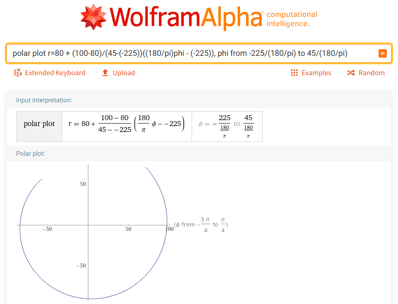
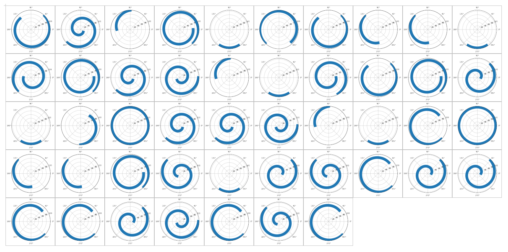

# Набор отрезков: Write-up

Можно заметить, что первая координата и левых, и правых точек почти везде делится на 45, а там, где не делится — делится на 30. Этот факт, а также разброс значений, намекает на возможность рассмотреть первую координату — аргумент функции — как угол в градусах.

Если в обычной декартовой системе координат (_x_, _y_) ограниченные линейные функции изображаются прямыми отрезками, то в полярной (_φ_, _r_) они могут быть частями спиралей или окружностей.

Например, построим график функции _f_₁. Выпишем выражение для линейной функции, помня, что углы следует записывать в радианах вместо градусов.



Делать это для всех 47 графиков было бы не очень удобно, поэтому можем открыть Jupyter Notebook и написать код, который строит график по двум заданным точкам.

```python
import matplotlib.pyplot as plt
%matplotlib inline
import numpy as np

def draw_polar(phi1, r1, phi2, r2):
    phi = list(range(phi1, phi2 + 1))
    r = [r1 + (r2-r1)*(p - phi1)/(phi2-phi1) for p in phi]
    
    plt.polar(np.array(phi) / (180 / np.pi), np.array(r), linewidth=15)
```

И построить все графики.

```python
for (phi1, r1), (phi2, r2) in [((-225, 80), (45, 100)), ((-495, 100), (-45, 20)), ...]:
    draw_polar(phi1, r1, phi2, r2)
    plt.show()
```

Посмотрим на графики чуть издалека.



Бросается в глаза, что первые графики образуют что-то, подозрительно похожее на слово _ugra_. Дальше идёт что-то, явно пытающееся быть символом подчёркивания. Остальные графики тоже образуют в целом узнаваемые английские слова — если какие-то буквы не удаётся опознать даже после нескольких минут пристального взгляда и анализа методом исключения, можно разрешить сомнения с помощью [поиска по словарю](https://www.dcode.fr/word-search-regexp). Буквы последней части флага — в этом задании это могут быть только _a_, _b_, _c_, _d_ и _e_ — по крайней мере по разу встречались в предыдущих словах, поэтому их можно восстановить, пользуясь предположением, что одинаковые буквы закодированы одинаковыми функциями.

Флаг: **ugra_null_pager_quad_jogger_collab_dbcddccdecbc**
