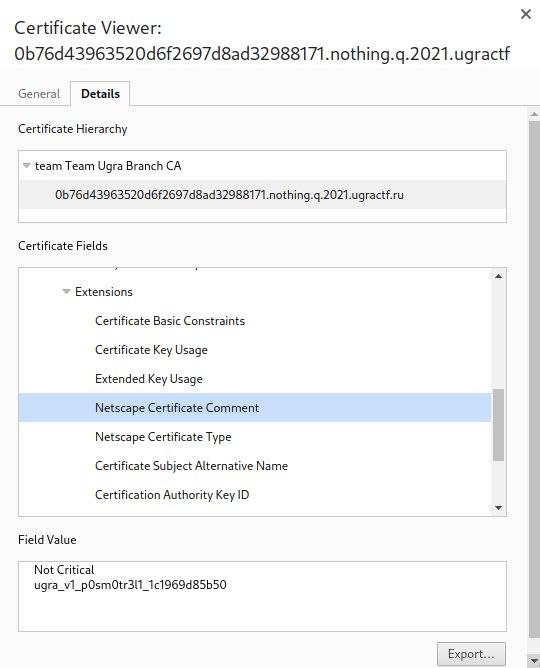

# Nothing to see: Write-up

При попытке перейти по ссылке из условия, понимаем, что у сайта проблемы с сертификатом. В лучшем случае браузер поругается, но всё же даст возможность войти (например, Firefox), в худшем он вам вовсе запретит посещать данную страницу. Если взять во внимание тот факт, что у других тасков таких проблем нет, можно предположить, что решение этого таска должно быть связано с сертификатом.

Давайте попробуем открыть сертификат. В Firefox нужно нажать на «замочек» слева от адресной строки, нажать на стрелочку, затем **More Information**, и, наконец, **View Certificate**. В Chrome нужно нажать на **Not secure** и выбрать **Certificate**. Видим, что на первый взгляд ничего флагоподобного в сертификате нет, или, по крайней мере, наш браузер нам этого не показывает, поэтому попытаемся посмотреть сертификат самостоятельно.

Скачаем сертификат. В Firefox в разделе **Miscellaneous** выберите **Download PEM (cert)**, в Chrome — **Details** → **Export**.

Нам поможет набор утилит `openssl` — она умеет в том числе и смотреть внутренности сертификата:

```shell
$ openssl x509 -in cert.pem -text -noout
```

Смотрим на вывод и видим флаг:

```
...
Netscape Comment: 
                ugra_v1_p0sm0tr3l1_1c1969d85b50
...
```

Помимо этого, `openssl` может скачать сертификат сам, и всё можно сделать в одну строку:

```shell
$ echo | openssl s_client -connect 0b76d43963520d6f2697d8ad32988171.nothing.q.2021.ugractf.ru:443 -showcerts | openssl x509 -text -noout | grep 'ugra'
        Subject: CN = 0b76d43963520d6f2697d8ad32988171.nothing.q.2021.ugractf.ru
                ugra_v1_p0sm0tr3l1_1c1969d85b50
                DNS:0b76d43963520d6f2697d8ad32988171.nothing.q.2021.ugractf.ru
```

В Chrome всё ещё проще: прямо в интерфейсе можно посмотреть все поля сертификата, включая то, что нас интересует:



Флаг: **ugra_v1_p0sm0tr3l1_1c1969d85b50**

<hr>

## Постмортем: Chrome и квадратные скобки

Как вы могли догадаться, изначально мы в название организации центра сертификации поставили [team Team]. В Chrome сайт в принципе не открывался — браузер считал сертификат невалидным. По непонятной нам причине, ошибка исчезла, когда мы убрали из названия квадратные скобки. Тем не менее, мы потратили несколько часов на диагностику проблемы и попытку сделать все поля максимально похожими на сертификаты предустановленных на компьютере CA.

И, тем не менее, даже после изменений нам не удалось заставить Chrome корректно открывать наш сайт — даже несмотря на то, что SSL Server Test от Qualys давал оценку A (кроме проблем с доверием к сертификату). Но ошибка о некорректном сертификате исчезла.

Если вы знаете, почему так случилось, расскажите нам — мы до сих пор так и не поняли.
