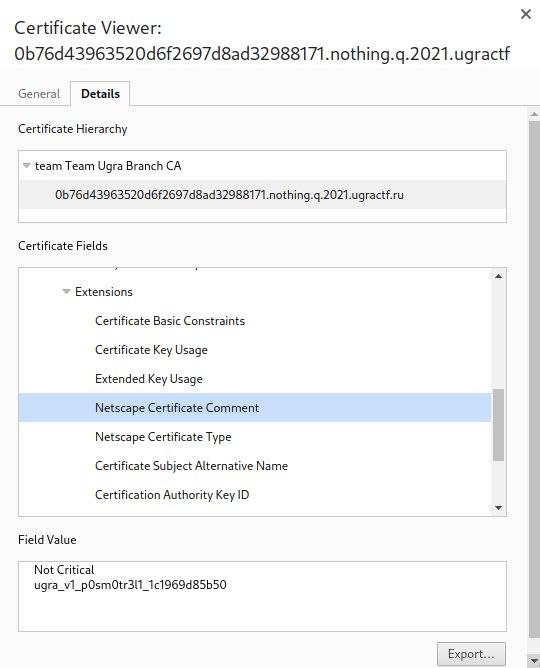

# Nothing to see: Write-up

При попытке перейти по ссылке из условия, понимаем, что у сайта беды с сертификатом. В лучшем случае, браузер поругается, 
но всё же даст возможность войти (если использовать Firefox), в худшем &mdash; он вам вовсе запретит посещать данную страницу.

Если взять во внимание тот факт, что у других тасков таких проблем нет, можно предположить, что решение этого таска должно 
быть связано с сертификатом.

Открываем сертификат (Firefox: «замочек» слева от адресной строки → стрелочка → More information; Chrome: большая кнопочка
"Not secure" → Certificate). Видим, что на первый взгляд ничего флагоподобного в сертификате нет, или, по крайней мере, 
наш браузер нам этого не показывает, поэтому попытаемся посмотреть сертификат самостоятельно.

Скачиваем сертификат (Firefox: раздел Miscellaneous → Download → PEM (cert); Chrome: Details → Export).
Для того, чтобы посмотреть на внутренности сертификата, используем команду `openssl`:

```shell
$ openssl x509 -in cert.pem -text -noout
```

Смотрим на вывод и видим флаг:

```
...
Netscape Comment: 
                ugra_v1_p0sm0tr3l1_1c1969d85b50
...
```

Также, таск можно было решить в одну строчку, загрузив сертификат сразу через `openssl`:

```shell
$ echo | openssl s_client -connect 0b76d43963520d6f2697d8ad32988171.nothing.q.2021.ugractf.ru:443 -showcerts | openssl x509 -text -noout | grep 'ugra'
        Subject: CN = 0b76d43963520d6f2697d8ad32988171.nothing.q.2021.ugractf.ru
                ugra_v1_p0sm0tr3l1_1c1969d85b50
                DNS:0b76d43963520d6f2697d8ad32988171.nothing.q.2021.ugractf.ru
```

Или ещё проще: потыкать в поля сертифката в Chrome.



Флаг: **ugra_v1_p0sm0tr3l1_1c1969d85b50**