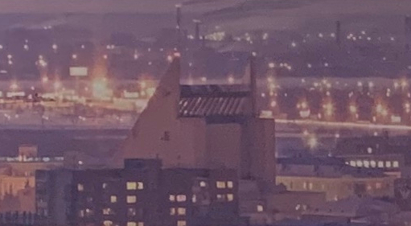
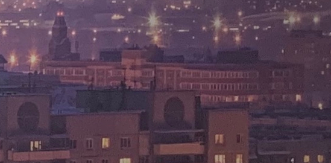
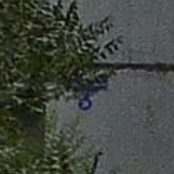
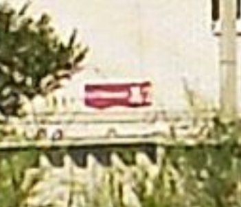

# Огни города поменьше: Write-up

Итак, дана [фотография](app/IMG_0586.HEIC), и требуется найти точку съёмки панорамы. Не самой фотографии — она, как напрямую следует из метаданных, сделана в Икее Тёплый Стан — а вот той панорамы, которая помещена на фон постера.

Не удаётся даже понять, что это за город. На кадре нет каких-то узнаваемых достопримечательностей, которые можно было бы легко скормить поиску по картинкам, только какие-то невнятные церкви вдалеке и торчащие острые уголки некоего здания. 

Что там на фоне, совсем далеко — вовсе непонятно. При всей невнятности бросается в глаза, что видимая область плотно застроена относительно высокими домами (9, 10, 12 этажей), и эти дома явно не относятся к новостройкам; точка съёмки находится ещё выше, на уровне не ниже 14–15 этажа. В маленьких городах такой застройки сложиться не могло, значит, мы имеем дело с каким-то довольно крупным городом бывшего СССР, вероятно, областным центром или столицей государства.

Вспоминаем (или берём [из Википедии списком](https://ru.wikipedia.org/wiki/Список_городов_России_с_населением_более_100_тысяч_жителей)) крупные города и ищем виды с высоты в надежде узнать здание с уголками или — а вдруг повезёт! — панельные дома с их декором.

Рано или поздно наш перебор доходит до Омска — и на какой-нибудь из панорам мы видим то самое здание с уголками — Омский государственный музыкальный театр.

Находим его на карте _(10 лет Октября, 2)_, включаем на полную катушку пространственное мышление и прикидываем по ориентации уголков примерное направление поиска.

Было бы неплохо найти кирпичный дом с закруглением, он, в отличие от серых панельных домов, явно такой один, без раскиданной по всему району армии похожих домов, с которыми его можно перепутать. К тому же, панельные дома хоть и обладают отличительными признаками, в полусумраке и при освещении фонарей их может быть не узнать на снятой днём панораме.

Пытаемся найти дом похожей топологии на карте и на спутниковом снимке, придерживаясь оцененной области. Однако найти ничего не можем — удаляемся всё дальше и дальше. В отчаянии разглядываем вообще любые дома, которые по спутниковому изображению могут показаться похожими на те, которые видно на панораме, удаляясь всё дальше и дальше от предполагаемой зоны поиска.

В какой-то момент нам попадается тот самый скруглённый дом, на который мы возлагали большие надежды _(10 лет Октября, 50)_. Обнаружив его совсем не там, всматриваемся и понимаем, что дом действительно тот, однако крыло слева от закругления на самом деле короче крыла справа, а на картинке — наоборот.

Теперь понятно, почему у нас ничего не получалось — **дизайнер, делавший постер для Икеи, зеркально отразил всю панораму**. Отражаем её обратно, чтобы не путаться, и смотрим на эту разотражённую нами версию. Снова призываем уголки театра для определения области поиска, на этот раз настоящей.

Разглядывая спутниковые снимки в поисках похожих по форме крыш и сверяясь с панорамами, методично находим дома вблизи: дом с тремя кругами над подъездами и тёмной полоской на четвёртом сверху этаже _(Иркутская, 3)_ и, например, дом с тёмными рамками вокруг подъездных окон _(Омская, 110)_.

Здесь мы можем захотеть поискать похожие картинки в интернете: вдруг кадр на постере на самом деле взят не полностью, и есть какие-нибудь здания поближе, которые помогут лучше понять обстановку?

И действительно, находим [версию с другой обрезкой](https://35photo.pro/photo_1222722/) и ближними домами, снятую хоть и в чуть другое время, но абсолютно точно с той же самой точки (неточности при наложении объясняются особенностями съёмки в Икее, однако мы чётко видим, что дома относительно друг друга расположены точно так же; съёмка даже из другой комнаты той же квартиры выглядела бы иначе). Заодно узнаём автора снимков.

Оглядываясь по сторонам в окрестности, опознаём ближайший дом _(Арнольда Нейбута, 14)_, дальний панельный дом с кирпичной пристройкой _(Омская, 117/2)_ и ближний панельный дом с кирпичной пристройкой и выступами на балконах _(Омская, 119)_.

Рисуем на карте линии между точками, которые находятся на одной прямой относительно точки съёмки — и находим точку пересечения.

Линии указывают между домами 38 и 38/2 на улице Богдана Хмельницкого. Оба дома достаточно высокие. Однако рисование линий между даже самыми северными и западными границами дома 38 и различными домами панорамы приводит совсем не туда, куда приводит линия взгляда на снимке. Так, синяя линия через угол дома Арнольда Нейбута, 14 уверенно проходит через угол дома Омская, 119, но если мы попытаемся нарисовать линию от Богдана Хмельницкого, 38 через угол Арнольда Нейбута, 14, то дом Омская, 119 она обойдёт мимо.

**Таким образом, фотография сделана из дома 38/2 на улице Богдана Хмельницкого.**

Кстати, на картах Гугла по неизвестной причине адреса указаны некорректно: дом 38 назван домом 38/2, а дом 38/2 — домом 38-корпус-2. Убедиться в том, что прав именно Яндекс, можно по панорамам — с определённых ракурсов можно разглядеть таблички 38 и 38/2, висящие на самих домах.

 

Итоговый ответ на задание в формате, ожидаемом проверяющей системой — **Россия, Омская область, г. Омск, ул. Богдана Хмельницкого, д. 38/2**.

Флаг: **ugra_[we_will_go_we_will_swim_we_will_crawl](https://www.youtube.com/watch?v=ZA_cEF_FaOk)_3fbdcedf2381**

Бонус: [карта](https://yandex.ru/maps/?um=constructor%3Ac347d84e4d556cbdb03110b207290157aea7e19a4bda0bd3ab6ee55480180c07) и [список](attempts.md) всех попыток сдать задание.

## Постмортем

Проверяющая система считала единственным правильным ответом такой: `Россия, Омская область, г. Омск, ул. Богдана Хмельницкого, д. 38`. Он был изначально вычислен описанным здесь методом, но без применения поиска по картинкам, в связи с чем геометрические прикидки оказались недостаточно точными, и дом 38/2 был сочтён неподходящей точкой.

Согласно обычаям нумерации, принятым в некоторых городах, включая Омск, числа после дроби используются, когда новому дому необходимо дать номер между существующими: дома 38 и 40 были уже давно построены, и новый дом получил номер 38/2. Отбрасывание «дробной части» или разбиение номера дома на элементы («38 корпус 2») в таком случае не являются корректными преобразованиями. Тем не менее, образец не давал однозначного ответа, как следует записывать такой адрес; участникам в ответ на вопрос о записи номера корпуса предлагалось подумать, о чём свидетельствует сам факт возникновения у них такого вопроса (то есть давался намёк, что верный ответ номера корпуса не содержит).

Изучение попыток ввода адреса показало, что у всех команд, пытавшихся сдать корректно отформатированный адрес с домом 38/2, среди попыток был и адрес с домом 38, приводивший к флагу — таким образом, неточность эталонного ответа не оказала существенного влияния на чей-либо результат.
