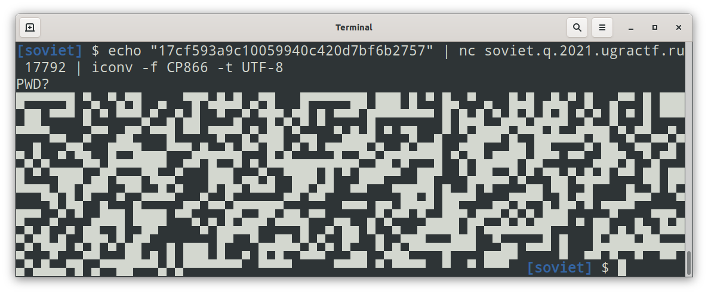

# ЦНИИВТ: Write-up

Участникам предлагается подключиться по TCP к порту. При подключении сервер спрашивает пароль, и в ответ выдаёт какой-то набор непечатаемых символов.

Судя по тому, что пароль спрашивали текстом, можно предположить, что и дальше идёт какой-то текст. Очевидно, что кодировка не UTF-8 — коды символов не начинаются ни с `0`, ни с `10`.

Попробуем различные кодировки. Намёки в условии указывают на то, что кодировка русскоязычная — таких не очень-то и много. В кодировке CP866 на первый взгляд ничего интересного. Однако, приглядевшись, мы видим, что это на самом деле QR-код без переносов строк: каждый символ соответствует области размером 1 × 2 пикселя.

Это сходится и с легендой: действительно, кодировка CP866 была [разработана в Советском Союзе](https://ru.wikipedia.org/wiki/CP866) и активно использовалась до прихода многобайтовых кодировок.

Декодируем QR-код и получаем флаг.

Флаг: **ugra_soviet_technologies_are_eternal_6e6cc9c6e93b**

Символичным оказалось то, что сервер отдаёт 866 байт за сессию. Это вышло случайно, и я заметил это, когда таск уже был готов.

Поскольку никто из разработчиков не пользуется Windows (и тем более — её русскоязычной версией), мы узнали о том, что встроенная командная строка сразу же рисует QR-код, уже в ходе соревнования от участников. Дело в том, что она по умолчанию использует ту самую кодовую страницу 866.
