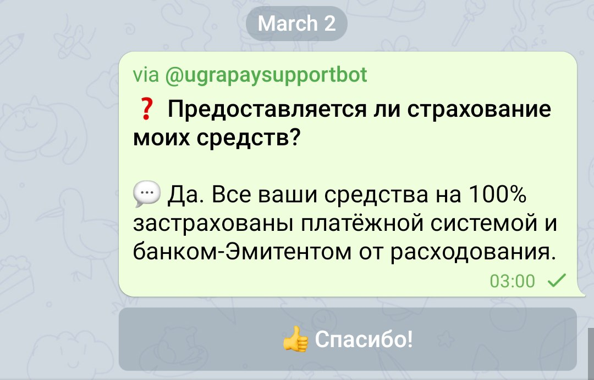
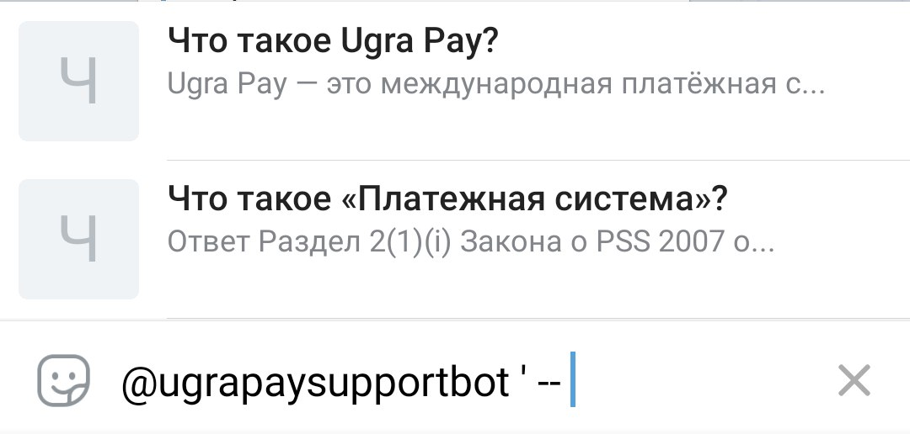
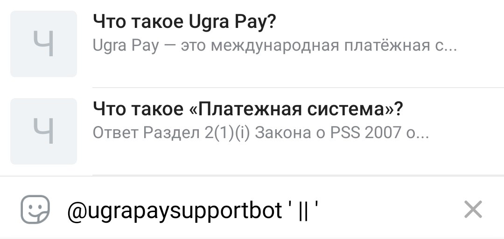
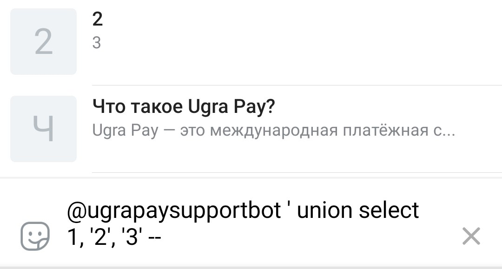
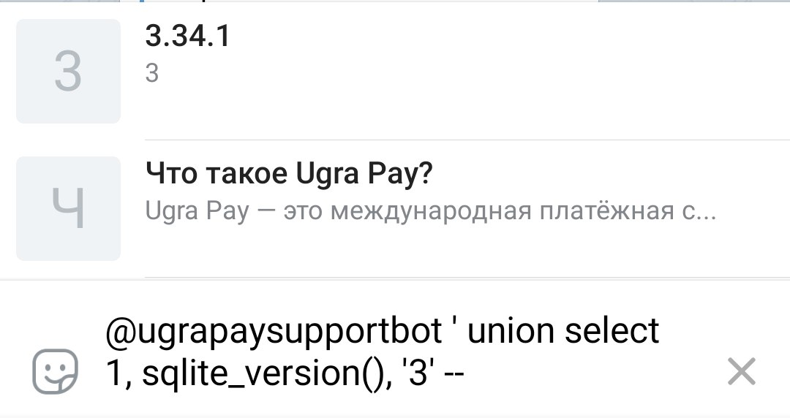
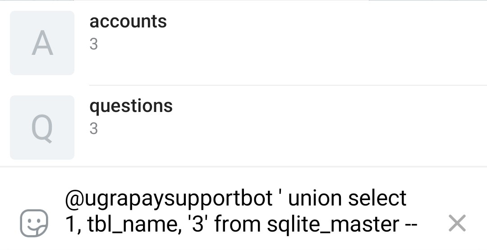
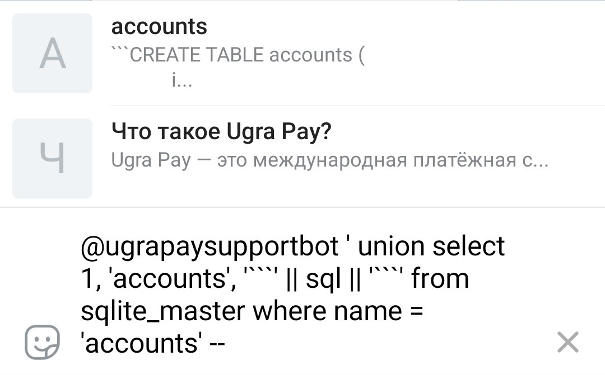
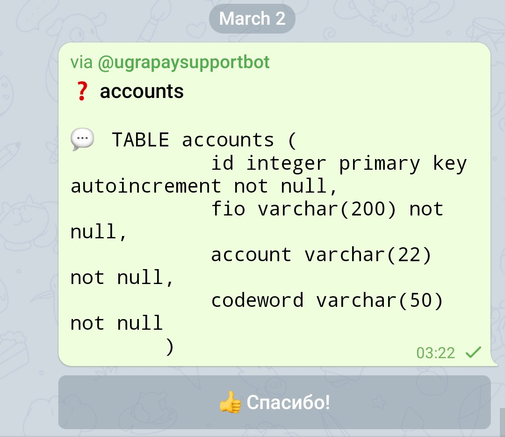
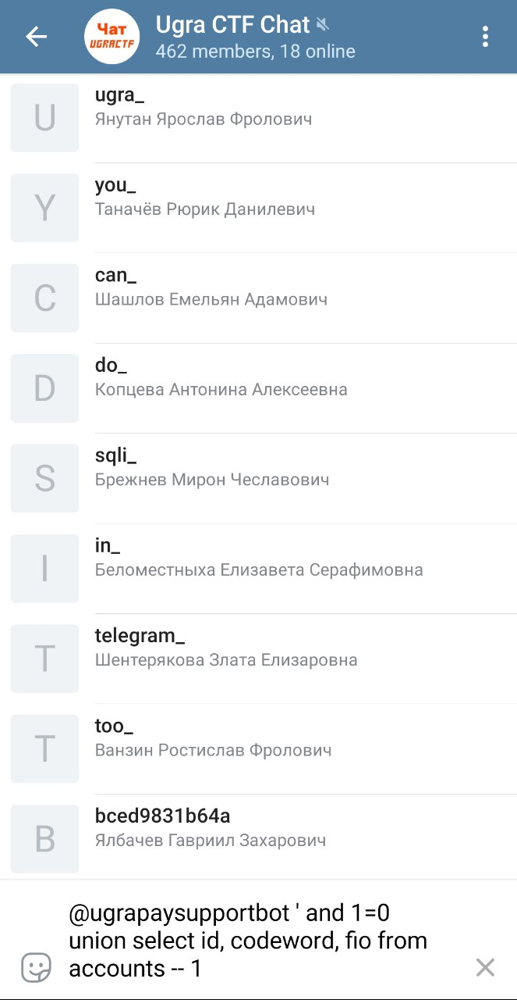

# База знаний: Write-up

Нам был дан Telegram-бот. Изучив его возможности, видим, что он умеет отвечать на 18 вопросов про некую платёжную систему Ugra Pay. На все команды и сообщения он отвечает, что операторов нет, и предлагает поискать вопрос в списке заготовленных.

Большего от бота добиться не удаётся — поэтому идём [в документацию Telegram](https://core.telegram.org/bots) узнавать, что в целом умеют боты. Из ещё не изученных интерфейсов ввода нам встречается [инлайн-режим](https://core.telegram.org/bots/inline): возможность отправки в чаты сообщений, подготовленных ботом. Например, многие пользуются этим режимом для отправки картинок или анимированных изображений:

Неожиданно мы выясняем, что эту же возможность поддерживает и наш бот для поддержки платёжной системы:

При выборе сообщения оно отправляется в чат:

Мы обращаем внимание, что поиск находит все вопросы, содержащие наш запрос. Но как же устроен поиск? Пробуем вводить различные данные и обнаруживаем, что при вводе апострофа (`'`) поиск перестаёт выводить результаты. Это может означать как ошибку, так и отсутствие результатов.

Нередко апострофы используются в качестве индикаторов начала и конца текстовой строки, в частности, в языке запросов SQL. Проверить, что мы реально «выбрались» из строки, можно разными способами. Мне, например, нравятся два таких:

Первый вариант закрывает нашу строку, после чего вставляет символ комментария: дальнейшая часть запроса не будет учтена. Второй вариант конкатенирует начало строки с её концом.

Если бы наша гипотеза была неверна, и никакой проблемы тут не было, то мы бы получили ноль результатов: действительно, вопросов с такими странными символами не было. Но мы получаем все вопросы в качестве ответа, поэтому нет никаких сомнений, что мы имеем дело с [SQL-инъекцией](https://course.ugractf.ru/web/server.html).

Мы будем использовать один из самых популярных способов эксплуатации инъекций — добавление новых данных через оператор `UNION`: он добавляет к одной таблицу другую. Чтобы его использовать, нам понадобится узнать количество столбцов в запросе и их типы. Простым перебором узнаём, что начало запроса возвращает три столбца, второй и третий отдаются в результатах запроса (и являются строками).

Чтобы успешно проэксплуатировать SQL-инъекцию, нам нужно узнать, какая конкретно СУБД находится на сервере. В этом нам помогут различные способы извлечь версию базы данных. Перебираем способы для всех популярных СУБД, и узнаём, что это SQLite:

На этом шаге можно перед `UNION` добавить в инъекцию условие `AND 1=0`, чтобы нам не мешали ответы на вопросы. Правда, это не даст нам различать ошибку сервера и отсутствие результатов — для нас в обоих случаях будет пустой ответ.

Теперь попытаемся понять, что же можно достать из базы данных. В большинстве СУБД информация о структуре базы данных хранится рядом, в служебных таблицах. В SQLite таблица со структурой базы называется `sqlite_master`:

Видим, что кроме таблицы `questions` есть таблица `accounts`. Вероятно, это то, что нам нужно. Из этой же таблицы можно достать информацию о структуре таблицы. При этом, чтобы не получать ответ по частям, просто отправим сообщение — оно вмещает гораздо больше информации, чем предпросмотр:

В таблице `accounts` четыре столбца — идентификатор, имя, номер счёта и кодовое слово. Извлекаем кодовые слова всех пользователей, замечаем идущих подряд пользователей с весьма говорящими словами.

Флаг: **ugra_you_can_do_sqli_in_telegram_too_bced9831b64a**

## Постмортем: Никому нельзя доверять

Изначальная версия этого таска была в другом. У Telegram-ботов есть инлайн-клавиатуры: например, в этом боте они позволяют выбрать нужный вопрос из предложенных вариантов.

При нажатии на кнопку клиент [отправляет в Telegram](https://core.telegram.org/method/messages.getBotCallbackAnswer) запрос, содержащий поле `data` — специальный идентификатор кнопки, который был [задан ботом](https://core.telegram.org/bots/api#inlinekeyboardbutton). Даже [в документации](https://core.telegram.org/bots/api#callbackquery) указано, что клиенты могут отправлять в этом поле произвольные данные.

Наш бот [использовал](app/server.py#L174) в качестве `data` первые 32 символа вопроса, и использовал полученное от Telegram значение в запросе: `question LIKE '%{data}%'`. Ожидалось, что именно здесь участникам придётся формировать SQL-инъекцию, с помощью написания собственного клиента поверх MTProto API. Но выяснилось, что Telegram в ответ на подобные запросы присылает ошибку — `DATA_INVALID`. Она возвращается на любой запрос, который вызывает что-то отличное от кнопок, присланных ботом. Пришлось придумать что-то другое, и, как нам кажется, получилось вполне неплохо.
