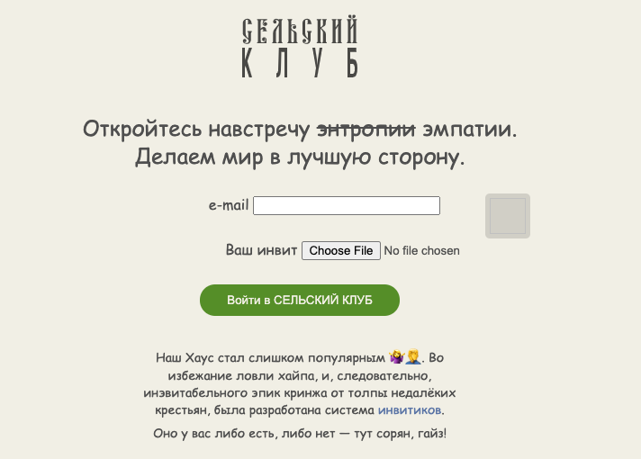

# Сельский клуб: Write-up

Видим сайт, отчаянно пытающийся подражать модному нынче [«Клабхаусу»](https://joinclubhouse.com/).



Чтобы попасть внутрь, необходимо где-то раздобыть инвайт. Благо, в условии таска дана шпионская фотография из-за плеча:


Если попробовать загрузить её как есть, сервер ругнётся ошбикой `413 Request entity too large`. Если, однако, кадрировать её по QR-коду, сервер примет её, но скажет, что «инвитик староват». 

Можно выяснить, что закодировано в _инвитике_, воспользовавшись утилитой _zbarimg_, которая доступна на многих платформах и поддерживает большое количество одно- и двухмерных штрих-кодов. Итак, QR-код на фотографии содержит в себе строковое представление числа `313337`, закодированное в [_Base64_](https://en.wikipedia.org/wiki/Base64):

```shell
$ zbarimg photo_cropped.png
QR-Code:MzEzMzM3
scanned 1 barcode symbols from 1 images in 0.02 seconds
$ echo MzEzMzM3 | base64 -d
313337
```

Предположим, что:

- это порядковый номер инвайта,
- инвайтов ограниченное количество,
- есть свободные инвайты.

Значит, можно решить задачу перебором. Это правда лишь отчасти, потому что сервер не даёт выполнить больше одного запроса в секунду, а пространство перебора может оказаться очень большим. Попробуем нащупать его, заслав несколько случайных _инвитиков_ и посмотрев на ответ сервера:

| Инвитик                       | Закодированное число | Ответ                                                   |
|-------------------------------|----------------------|---------------------------------------------------------|
|          | 0                    | `Ошибка: инвитик староват!!`                            |
|         | −1                   | `Ошибка: инвитик староват!!`                            |
|      | 10000                | `Ошибка: инвитик староват!!`                            |
|    | 6185084              | `Error: Hi! У вас инвит недействительный! Good bye!`    |
|   | 99999999             | `Вы что вообще заслали? Ну-ка быстренько исправляемся!` |

Ошибки бывают трёх родов:

1. код уже использован и староват (есть новее),
2. код уже использован (предположим, что это означает, что кодов, новее нет),
3. код неизвестен серверу (предположим, что это означает, что число инвайтов меньше, чем порядковый номер засланного _инвитика_).

То есть, сервер сообщает достаточное информации, чтобы можно было найти неиспользованный код [бинарным поиском](https://ru.wikipedia.org/wiki/Бинарный_поиск) за относительно небольшое число попыток (если, конечно, озвученные выше предположения верны).

1. Пробуем заслать какой-нибудь случайный код, например, 10000. Получаем ошибку первого рода. Значит, надо брать больше.
2. Пробуем заслать код с номером _вдвое_ больше: 20000. Снова получаем ошибку первого рода.
3. Повторяем шаг 2, пока не получим другую ошибку. Узнаём, что свободные _инвитики_ точно лежат где-то между 5120000 и 10240000.
4. Пробуем середину интервала [5120000, 10240000]: `10240000 - (10240000 // 4)`, число 7680000. Получаем ошибку второго рода — новее _инвитиков_ нет. Это позволяет нам уточнить верхнюю границу интервала: [5120000; 7680000].
5. Повторяем шаг 4 и уточняем интервал, пока (осознанно или случайно) не наткнёмся на свободный код.

Ура, мы внутри. Заходим в комнату, слушаем занимательный диалог: персонажи сперва обсуждают бытовые проблемы, а затем один из гостей «Сельского клуба» диктует другому флаг.

Флаг: **ugra_come_for_tasks_stay_for_f05da37e97c3**
